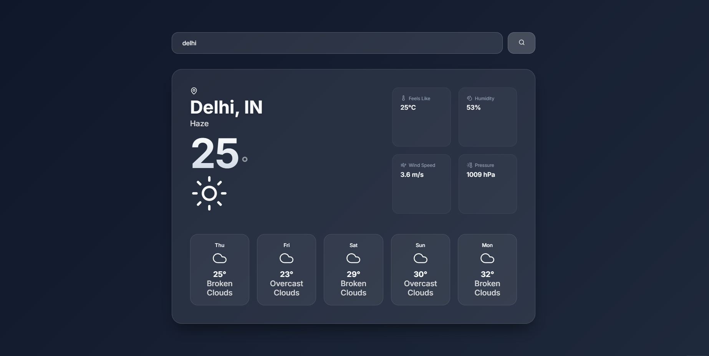
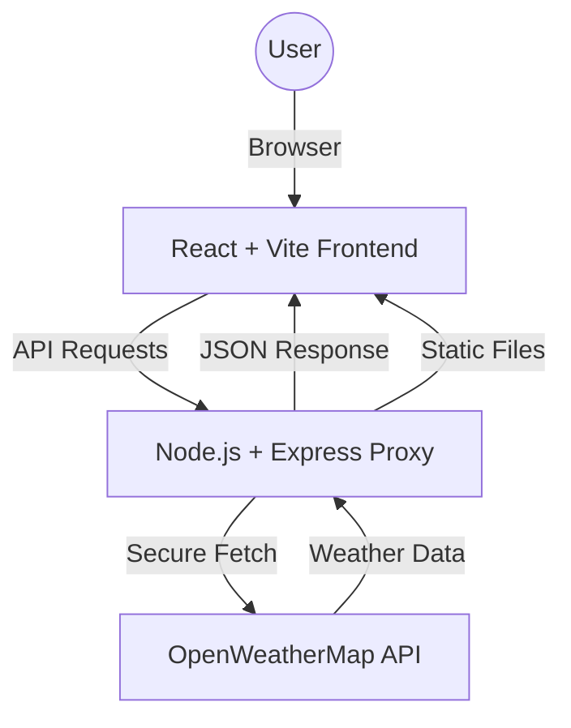

# 🌤️ My Weather App

A modern full-stack weather dashboard built with React and Node.js. It features a sleek glassmorphism design, real-time weather updates, and a 5-day forecast.



## 🚀 Key Features

- **Real-time Weather**: Accurate data for over 200,000 cities worldwide.
- **5-Day Forecast**: Detailed daily breakdown of upcoming weather trends.
- **Premium UI/UX**:
  - **Glassmorphism**: Elegant, translucent components with backdrop-blur effects.
  - **Dark Mode**: Sophisticated slate-navy theme for a modern look.
  - **Micro-animations**: Smooth entry and hover transitions.
  - **Large Icons**: Visual-first design with high-quality Lucide icons.
- **Unified Architecture**: The backend serves both the API and the frontend production build, making deployment a breeze.
- **Secure API Proxy**: API keys are hidden on the server, preventing exposure in the browser.

---

## 🏗️ Project Architecture



---

## 📁 Repository Structure

- **`/frontend`**: React project built with Vite. Contains the UI components and custom design system.
- **`/backend`**: Express server that proxies requests and serves the frontend production build.
- **`README.md`**: This file, providing a high-level overview.

---

## 🛠️ Tech Stack

| Component | Technologies |
| :--- | :--- |
| **Frontend** | React, Vite, Lucide React, Vanilla CSS |
| **Backend** | Node.js, Express, Axios, Dotenv, Cors |
| **API** | OpenWeatherMap (Current & Forecast) |

---

## 🚀 Deployment Guide (Production Ready)

This project is configured for both **Unified Deployment** and **Split Deployment** (Vercel + Render).

- **Detailed Instructions**: See [DEPLOYMENT.md](file:///d:/Apna%20College%20-%20Sigma%203.0%20Batch/Sigma%203.0%20(Devlopment)/Weather%20app%20Unified%20Project/DEPLOYMENT.md) for step-by-step guides on Vercel and Render.

### 1. Build the Frontend
Navigate to the `frontend` folder and build the production assets:
```bash
cd frontend
npm install
npm run build
```

### 2. Configure Backend
Ensure your `.env` file in the `backend` folder is correctly set:
```env
PORT=5000
WEATHER_API_KEY=your_api_key_here
WEATHER_API_URL=https://api.openweathermap.org/data/2.5/weather
```

### 3. Start the Unified Server
Navigate to the `backend` folder and start the server:
```bash
cd backend
npm install
npm start
```

Your app will now be live on `http://localhost:5000` (serving both the API and the React UI)!

---

## 💻 Local Development Setup (For Reviewers)

To run this project locally in development mode (with hot-module reloading and the Vite proxy):

### 1. Backend Setup
1. CD into the backend directory: `cd backend`
2. Install dependencies: `npm install`
3. Copy the example environment file: `cp .env.example .env` (or manually rename it)
4. Add your OpenWeatherMap API key to `.env`
5. Start the backend server: `npm run dev` (or `node index.js`). It will run on `http://localhost:5005`.

### 2. Frontend Setup
1. Open a **new terminal window** and CD into the frontend directory: `cd frontend`
2. Install dependencies: `npm install`
3. *(Optional)* Copy `.env.example` to `.env`. For local development, the Vite proxy in `vite.config.js` will automatically route `/api` requests to `http://localhost:5005`, so you don't need to configure `VITE_API_BASE_URL` locally.
4. Start the Vite dev server: `npm run dev`
5. Visit the Localhost URL provided in the terminal to view the app!

---

## 🎨 Design Philosophy

The project follows a **"Premium-First"** approach:
- **Contrast**: High readability with white text on dark slate gradients.
- **Blur**: Strategic use of `backdrop-filter` for depth.
- **Spacing**: Generous padding and margins for a non-cluttered look.
- **Icons**: Large, atmospheric icons that change with the weather status.

---
